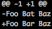

# DiffLib

DiffLib is a Hack library for creating and parsing diffs. Diffs can be created
between any two sequences of items. Additional helpers (such as support for
unified diffs, and colored diffs) are provided for string diffs.

Diffs are represented as a sequence of `DiffOp` operations; these can 'keep' an
element (i.e. it's unchanged in both sequences), insert an element, or delete an
element. For example, in a unified diff, these would be:

```diff
 DiffKeepOp
-DiffDeleteOp
+DiffInsertOp
```

String diffs are typically represented as a sequence of lines, but can also be
represented as a sequence of characters, allowing intra-line diffs.

## Diff output formats

difflib can create standard unified diffs:



difflib can also create colored diffs, with intra-line edits highlighted:


A concrete implementation is provided for standard CLI terminals, and an
abstract base class for other implementations, such as HTML or XHP.

## Examples

```Hack
use namespace Facebook\DiffLib;

function create_unified_diff(string $from, string $to): string {
  return DiffLib\StringDiff::lines($from, $to)->getUnifiedDiff();
}

function create_colored_diff(string $from, string $to): string {
  return DiffLib\CLIColoredUnifiedDiff::create($from, $to);
}

final class IntDiff extends DiffLib\Diff {
  const type TContent = int;
}

function dump_int_diff(vec<int> $from, vec<int> $to): void {
  $diff = (new IntDiff($from, $to))->getDiff();
  foreach ($diff as $op) {
    if ($op is DiffLib\DiffKeepOp<_>) {
      \printf("  %d\n", $op->getContent());
    } else if ($op is DiffLib\DiffDeleteOp<_>) {
      \printf("- %d\n", $op->getContent());
    } else {
      $op = $op as DiffLib\DiffInsertOp<_>;
      printf("+ %d\n", $op->getContent());
    }
  }
}

```

`dump_int_diff(vec[1, 3, 9], vec[1, 4, 9])` will produce this output:

```
  1
- 3
+ 4
  9
```

## Requirements

* The current release version of HHVM

## Installing DiffLib

```
composer require facebook/difflib
```

## How DiffLib works

Diffs are created using Myers' diff algorithm:
Myers, E.W. Algorithmica (1986) 1: 251. https://doi.org/10.1007/BF01840446

For more details, see [the commented implementation](src/Diff.php).

## Full documentation

- `DiffLib\Diff`: abstract base class. Needs to be subclassed to operate on
  any particular type.
- `DiffLib\StringDiff`: final class for diffing strings, and adds support
  for creating unified diffs
- `DiffLib\ColoredUnifiedDiff`: abstract class for rendering unified diffs.
  Output may be any type - for example, strings or XHP.
- `DiffLib\CLIColoredUnifiedDiff`: abstract final class for rendering unified
  diffs to a terminal that supports color escape sequences. Provides intra-line
  highlighting.
- `DiffLib\DiffOp`: abstract class for a diff operation. Sealed to
  `DiffInsertOp`, `DiffKeepOp`, and `DiffDeleteOp`.
- `DiffLib\cluster()`: utility function to group together sequential operations
  of the same kind. Converts `vec<DiffOp<T>>` to a generally shorter number of
  `vec<DiffOp<vec<T>>>`

## License
DiffLib is MIT licensed, as found in the LICENSE file.
